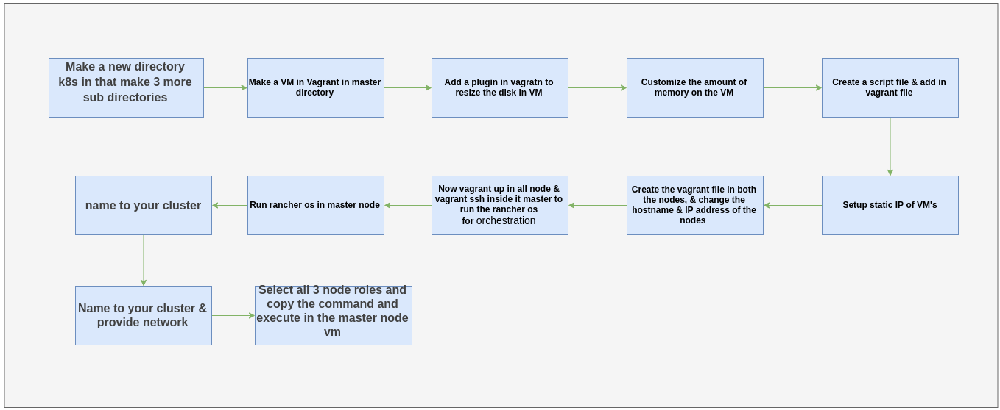

K8s Setup
=========

Section:1
---------

Final vagrant and script files for the various nodes to get quickly started (Ready to go files)

.. list-table:: Scripts
   :widths: 15 20 20
   :header-rows: 1

   * - Hostname
     - Vagrantfile
     - script.sh
   * - master.osive.lab
     - :download:`VagrantFile <scripts/master1/Vagrantfile>`
     - :download:`script.sh <scripts/master1/script.sh>`
   * - node1.osive.lab
     - :download:`VagrantFile <scripts/node1/Vagrantfile>`
     - :download:`script.sh <scripts/node1/script.sh>`
   * - node2.osive.lab
     - :download:`VagrantFile <scripts/node2/Vagrantfile>`
     - :download:`script.sh <scripts/node2/script.sh>`

Follow the steps below to get started with local kubernetes cluster using rancher docker containers

    * Make a new directory *K8s* in that make 3 more sub directories

        1. master
        2. node1
        3. node2

        .. code:: bash

            $ mkdir k8s
            $ mkdir master node1 node2
            $ ls

        .. image:: images/k8s1.png

    * Now ``vagrant init bento/ubuntu-20.04`` in the master node

        .. code:: bash

            $ vagrant init bento/ubuntu-20.04

    * Download and replace the scripts from the above into directories

``Move to Section:3, if no changes are required``

Section:2
----------

Steps Explaination (Change according to requirements):

    * Open the vagrantfile of the master node and give the disksize, give the hostname master, set the network to dhcp

    .. code:: bash

        Vagrant.configure("2") do |config|
            config.vm.box = "bento/ubuntu-20.04"
            config.vm.host_name = "master"
            config.vm.network "public_network",
            use_dhcp_assigned_default_route: true
            config.disksize.size = '100GB'

    * Vagrant plugin that creates a persistent storage and attaches it to guest machine

    * Change the persistent storage:-

        .. code:: bash

            config.persistent_storage.diskdevice = '/dev/sdb'
            config.persistent_storage.enabled = true
            config.persistent_storage.location = "~/development/ceph-disk.vdi"
            config.persistent_storage.size = 100000
            config.persistent_storage.use_lvm = false
            config.persistent_storage.partition = false          

    * Customize the amount of memory on the VM

    .. code:: bash

            vb.memory = "8192"
            vb.cpus = "2"
            vb.name = "master"
        # Prevent VirtualBox from interfering with host audio stack
            vb.customize ["modifyvm", :id, "--audio", "none"]
        end

**Look at the current path. Output (commented for easier copying and pasting of commands)**

    .. code:: bash

        $ vboxmanage list systemproperties | grep machine

        Default machine folder:          /home/---/VirtualBox VMs

    * Set it to a different folder in your home aka ~
    * If you user has access to the path and can create files/folders, then
    * the folder doesn't need to exist beforehand, Virtualbox will create it

    .. code:: bash

            $ vboxmanage setproperty machinefolder ~/VirtualMachines

    * No output produced

        .. code:: bash

                $ vboxmanage list systemproperties | grep machine

Section:3
-----------

Provision VMs for kubernetes

    * For Vagrant up in all nodes run the script ``Initial-setup.sh``

    .. code:: bash

        date >> ~/log.txt 
        cd master1
        vagrant up
        cd ../node1
        vagrant up
        cd ../node2
        vagrant up
        date >> ~/log.txt
        echo "started"  | tee -a  ~/log.txt

    * Apply permission and run the Script to up all the nodes

    .. code:: bash

        $ ./Initial-setup.sh

    * SSH into the master node 

        .. code-block:: bash

            cd ~/vagrant/k8s/master
            vagrant ssh
    
    * Now run the Rancher OS container in the master node:- 

        .. code:: bash

            $ docker run  --name rancher -d --restart=always -p 192.168.0.245:8000:80 -p 443:443 rancher/rancher

    * Then open up your browser and open web app of rancher os by using master node ip address.

        * Click ``Add Cluster``

            .. image:: images/k1.png

        * Select ``From existing nodes``

            .. image:: images/k2.png

        * Provide name to your cluster

            .. image:: images/k3.png

        * Always select ``weave`` network provider.

            .. image:: images/k4.png

        * Press ``next``

            .. image:: images/k5.png

    * Choose what roles the node will have in the cluster 

        .. image:: images/k6.png

    * Copy and paste the generated command in the master node

        .. image:: images/k6-1.png

    * Now in Node options select only worker and give them IP for Worker node1 & node2 then copy and paste the generated command in the worker nodes

        .. image:: images/k-node.png

    * for IP ...211 run the command in the node1 & for IP ...212 run the command in container node2

        .. image:: images/k-node1.png

    * You have to wait for few minutes for the cluster to be active.

            .. image:: images/k7.png