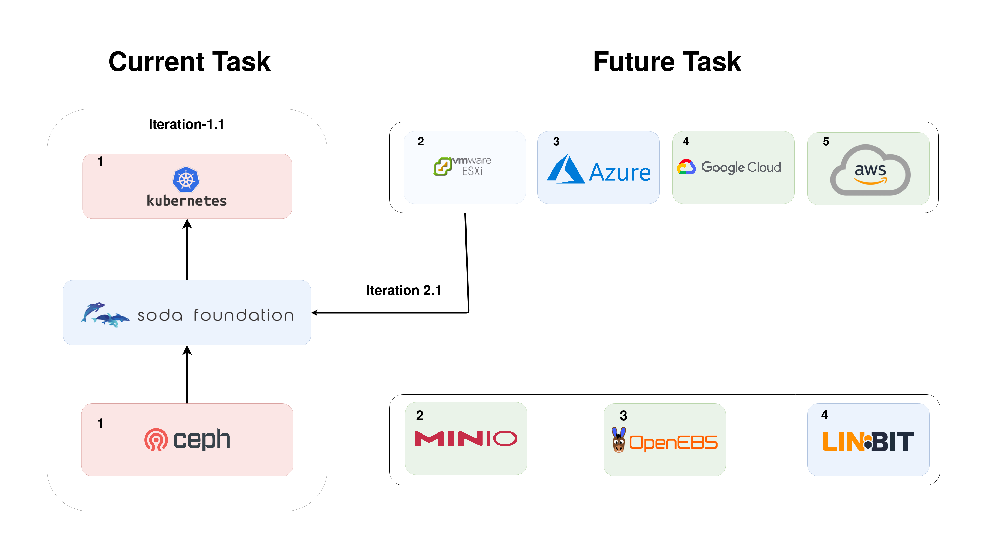

SODA Task
=========

Below diagram depicts the Tasks:

**Task Table Overview:**

    +------+--------------+----------+---------+
    | Task | Platform     | Sub-Task | Storage |
    +------+--------------+----------+---------+
    |      |              |      1.1 | Ceph    |
    |      |              +----------+---------+
    |      |              |      1.2 | Minio   |
    |    1 | Kubernetes   +----------+---------+
    |      |              |      1.3 | OpenEBS |
    |      |              +----------+---------+
    |      |              |      1.4 | LinBit  |
    +------+--------------+----------+---------+
    |      |              |      2.1 | Ceph    |
    |      |              +----------+---------+
    |      |              |      2.2 | Minio   |
    |    2 | Vmware ESXi  +----------+---------+
    |      |              |      2.3 | OpenEBS |
    |      |              +----------+---------+
    |      |              |      2.4 | LinBit  |
    +------+--------------+----------+---------+
    |      |              |      3.1 | Ceph    |
    |      |              +----------+---------+
    |      |              |      3.2 | Minio   |
    |    3 | Azure        +----------+---------+
    |      |              |      3.3 | OpenEBS |
    |      |              +----------+---------+
    |      |              |      3.4 | LinBit  |
    +------+--------------+----------+---------+
    |      |              |      4.1 | Ceph    |
    |      |              +----------+---------+
    |      |              |      4.2 | Minio   |
    |    4 | Google Cloud +----------+---------+
    |      |              |      4.3 | OpenEBS |
    |      |              +----------+---------+
    |      |              |      4.4 | LinBit  |
    +------+--------------+----------+---------+
    |      |              |      5.1 | Ceph    |
    |      |              +----------+---------+
    |      |              |      5.2 | Minio   |
    |    5 | AWS          +----------+---------+
    |      |              |      5.3 | OpenEBS |
    |      |              +----------+---------+
    |      |              |      5.4 | LinBit  |
    +------+--------------+----------+---------+
